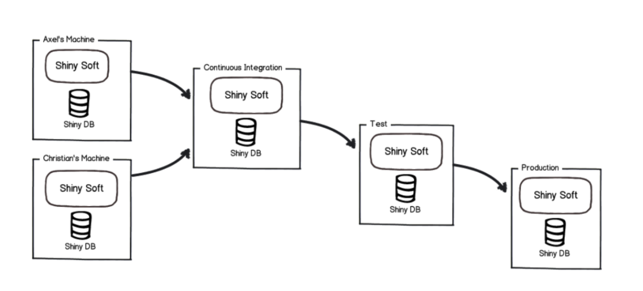

## 👉 [Flyway 적용해보기](README2.md)

# Flyway란?

- 오픈 소스 데이터베이스 마이그레이션 도구
- 데이터베이스의 형상관리를 목적으로 하는 툴이다.
    - 데이터베이스의 형상관리란?
        - git을 통해 우리가 코드를 관리하는 것의 데이터베이스 버전으로 볼 수 있다.
        - git에서는 코드를 파일별로 로깅을 통해서 변화의 이력을 추적한다.
        - flayway는 데이터베이스의 DDL 이력을 쌓아서 DDL이 어떻게 변화되었는지 관리하는 툴로 사용할 수 있습니다.

- 버전별 DB 스크립트 파일을 열거 해 두면 알아서 SQL 파일을 수정해 주고 DB 변경 이력에 대한 관리를 해주는 도구
- 공식 사이트에 따르면 gradle, maven, CLI, Java API 입니다.

## 왜 사용해야 할까?

### 휴먼에러
* 배포환경이 다양한 상황에서 직접 변경을 다룬다면 번거로움과 실수가 발생하기 쉽다. 
    * DB의 종류가 달라지면서 문법이 바뀔 수도 있고 다양한 상황에서 실수가 나올 수 있다.

### 히스토리 관리
* 문제가 생겼을 때 변경된 이력을 알 수 있음이 명확해지기 때문에 문제를 빠르게 해결할 수 있다.

### 환경분리
* 환경을 보다 쉽게 분리하고 관리가 가능하다.

## Flyway 특징
### 장점
1. 여러 데이터베이스 및 서버에 따른 패치 적용 여부를 관리할 수 있다.
2. 패치 스크립트의 히스토리 관리가 가능하다.
3. 패치 작업 시 사람의 실수를 방지할 수 있다.

### 단점
1. 최초 baseline 실행 시 모두 같은 형상을 가지고 있어야 한다.
2. 데이터가 다르면 DML을 통한 로직 정보가 있다면 다른 결과를 가져올 수 있다.
3. 스키마 비교를 할 수 없다.

## 동작방식
1. 설치 후 기본 설정을 진행하면 버전 관리 테이블이 생성됩니다.
2. Flyway는 마이그레이션을 위해 파일 시스템이나 클래스 패스를 검사합니다.
3. 마이그레이션은 버전 번호를 기준으로 정렬 되고 순서대로 적용합니다.
    1. 각 마이그레이션이 적용될 때마다 스키마 기록 테이블이 그에 따라 업데이트 됩니다.

### Flyway 명령어 알아보기
* init -SCHEMA_VERSION 을 baseline 과 함께 생성한다. 테이블이 이미 생성되어 있으면 수행되지 않는다.
* migrate - 스키마정보를 리얼DB에 마이그레이션한다.
* clean - flyway로 생성한 스키마를 모두 삭제한다고 하지만, 해당 데이터 베이스의 모든 테이블을 삭제한다.
* info - DB에 적용된 스키마 정보와, 로컬에 pending 되어있는 변경 정보를 보여준다.
* validate - DB에 적용된 스키마 정보와, 로컬의 변경점을 비교하여 보여준다.
* repair - 마이그레이션 실패한 내역을 수정한다 (삭제, 교체)
* baseline - flyway로 형상 버전관리를 시작 할 baseline 을 설정한다.
