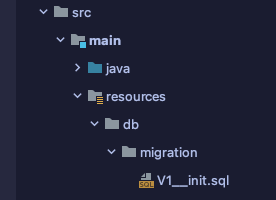
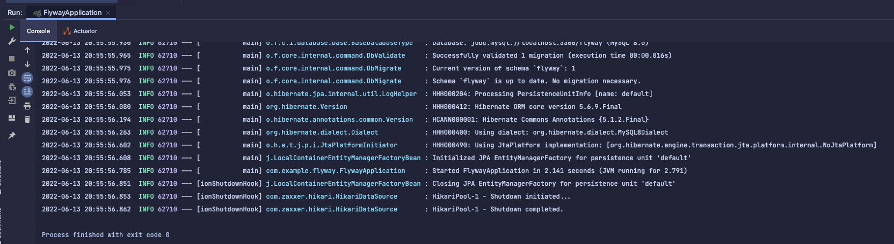
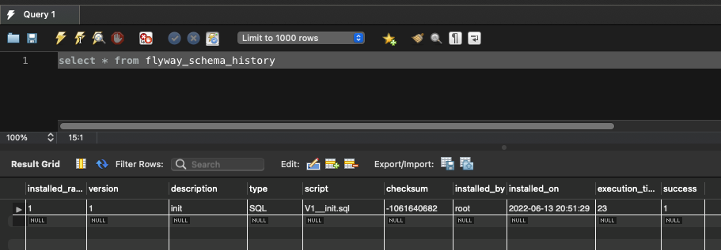
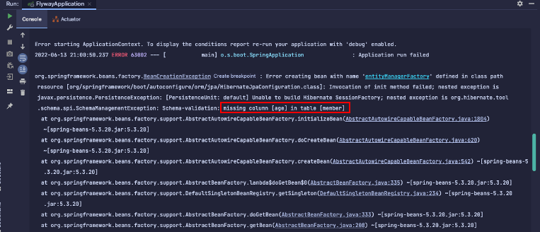
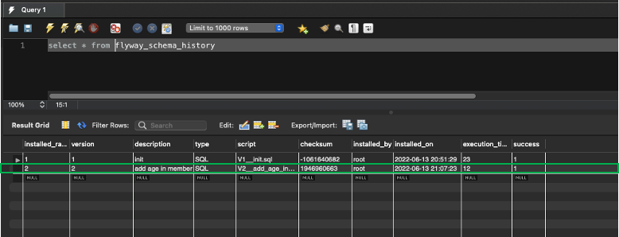
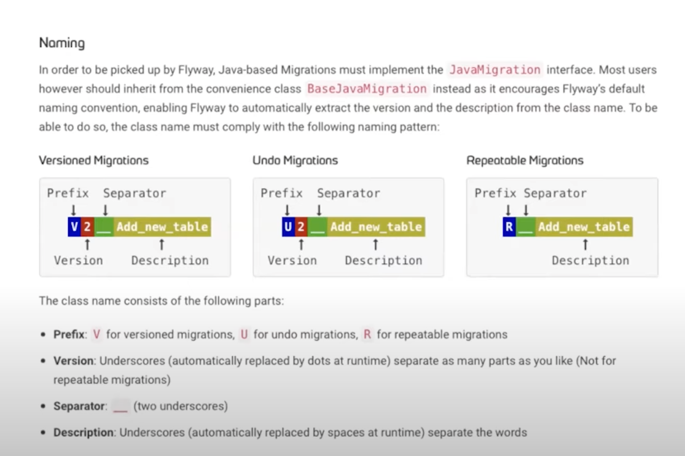
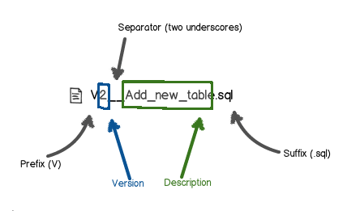

## Flyway 사용해보기

* 적용예제는 테코톡 영상을 보면서 적용하였습니다.
  https://www.youtube.com/watch?v=pxDlj5jA9z4

### 1. build.gradle 의존성 추가하기
```groovy
dependencies {
  runtimeOnly 'mysql:mysql-connector-java'
  compileOnly "org.flywaydb:flyway-mysql"
  implementation 'org.flywaydb:flyway-core:8.5.12'
}
```

### 2. yml 설정파일 추가
```yaml
spring:
  datasource:
    driver-class-name: com.mysql.cj.jdbc.Driver
    url: jdbc:mysql://localhost:3306/flyway
    username: username
    password: password
  jpa:
    hibernate:
      ddl-auto: validate
    generate-ddl: false
    properties:
      hibernate:
        jdbc:
          lob:
            non_contextual_creation: true
  flyway:
    baseline-on-migrate: true
    enabled: true
```
* enabled:true 
  * 이 경우는 메타데이터 테이블(변경이력 테이블)이 자동으로 생성이 되는데 안되는 경우가 있을 수 있기 때문에 추가해준다.

## 3. 예시 맴버 엔티티 작성
```java
@Entity
public class Member {

    @Id
    @GeneratedValue(strategy = GenerationType.IDENTITY)
    private Long id;
    private String name;

    protected Member() {}

    public Member(String name) {
        this.name = name;
    }

    public Long getId() {
        return id;
    }

    public String getName() {
        return name;
    }

}
```

## 4. 테스트 해볼 스프링 앱 코드 작성
```java
@SpringBootApplication
public class FlywayApplication {

    private final EntityManager em;

    public FlywayApplication(EntityManager em) {
        this.em = em;
    }

    public static void main(String[] args) {
        SpringApplication app = new SpringApplication(FlywayApplication.class);
        app.setWebApplicationType(WebApplicationType.NONE);
        ConfigurableApplicationContext run = app.run(args);

        FlywayApplication flywayApplication = (FlywayApplication) run.getBean("flywayApplication");

        Member member = new Member("sample");
        flywayApplication.save(member);
    }

    @Transactional
    public void save(Member member) {
        em.persist(member);
    }
    
}
```

## 5. 변경 이력 파일 작성
> **main/resources/db/migration** 에 작성을 해 주어야 한다!


### 6. V1 파일 작성
* 파일 명은 바꿀 수 있으며 초기 상태는 아래와 같이 작성합니다.
* V1__init.sql 
  * _ < 두개입니다.
```mysql
# V1__init.sql

drop table if exists member;

create table member(
    id bigint auto_increment,
    name varchar (255),
    primary key (id)
);

```

### 7. 테스트용 앱 실행 
* 정상적으로 실행 될 경우 아래와 같이 나오게 됩니다.



* 잘 적용 되었는지 데이터베이스에 쿼리를 실행시켜 보면 아래와 같은 결과가 나오게 됩니다.



### 8. 새로운 기능을 개발해보기
* age 필드를 추가해 봅니다
```mysql
@Entity
public class Member {

    @Id
    @GeneratedValue(strategy = GenerationType.IDENTITY)
    private Long id;
    private String name;
    private int age;

    // 생성자, 게터세터 생략
}
```

* 필드만 추가하고 앱을 실행시킨다면 자동으로 age를 추가해 줄 것 같지만 그렇지 않습니다.


* 그 이유는!?
> flyway에게 테이블에 어떤 변경이 일어났는지 알려주지 않았기 때문입니다. <br>
> **변경사항을 알려주기 위해 migration script를 작성해주어야 합니다.**

### 9. migration script V2 작성해주기
* flyway에게 어디가 변경되었는지만 알려주면 됩니다 !
```mysql
# V2__add_age_in_member.sql

ALTER TABLE member ADD COLUMN age integer DEFAULT 0
```

### 10. 변경사항이 잘 적용 되었는지 앱 실행시키기
* 변경사항이 잘 적용된 것을 확인하실 수 있습니다.



## 번외) 스크립트 네이밍 & DB Location 설정하기

#### 11-1 네이밍 짓기




* prefix
  * 파일명의 V는 Version을 명시한 prefix입니다. Version을 제외한 Undo, Repetable 도 존재합니다.
    * Undo는 U를 prefix로 명시합니다.  
    * Repetable은 R을 prefix로 명시합니다.
      * Repetable은 버전에 상관없이 계속 실행되는 스크립트를 말한다.
      * 테스트를 편하게 진행하기 위해 member 더미데이터를 매번 추가해야 한다면?
        * R__insert_member_data.sql 이런 식으로 사용할 수 있따.


* 버전 명시
  * 예제에서는 V1, V2 간단하게 버전을 명시해 주었지 다양하게 가능하다
    * V1__description
    * V1.1__description
    * V1.2.9__description
    * V2__description
    * V20220613_description
  

* description 
  * 명확하게 작성해 주면 된다.
    * Member 테이블의 이름을 Manager로 바꾸려면?
      * V3__change_name_member_to_manager.sql
  
#### 11-2 위치 지정하기

* 현재 위치는 main/resources/db/migration 을 고정시켜두었지만 꼭 이 위치에 저장하지 않아도 됩니다.
  * 현재 경로는 flyway의 default 설정 값입니다.
  
* 하지만 경로를 커스텀하게 지정하면 이점이 많습니다.


* spring.flyway.location 키로 원하는 위치를 잡아주면 됩니다.
  * migration script 저장하는 위치를 바꿀 수 있습니다.
```yaml
spring:
  flyway:
    location: classpath:db/migration/test
```

 * {}를 이용하여 vendor를 사용하면 DB종류를 기준으로 로케이션을 나눌 수 있습니다.
   * 로컬에서 H2 DB를 사용한다면 H2 migration 폴더를 읽게되고
   * 배포환경에서 Mysql을 사용한다면 Mysql migration 폴더를 읽게됩니다.
```yaml
spring:
  flyway:
    location: classpath:db/migration/{vendor}
```

* 로컬에서만 특별히 더미값을 넣어주고 싶을때 로케이션을 2개 지정해줄 수도 있습니다.
```yaml
spring:
  flyway:
    location: classpath:db/migration/{vendor}, classpath:db/seed
```
